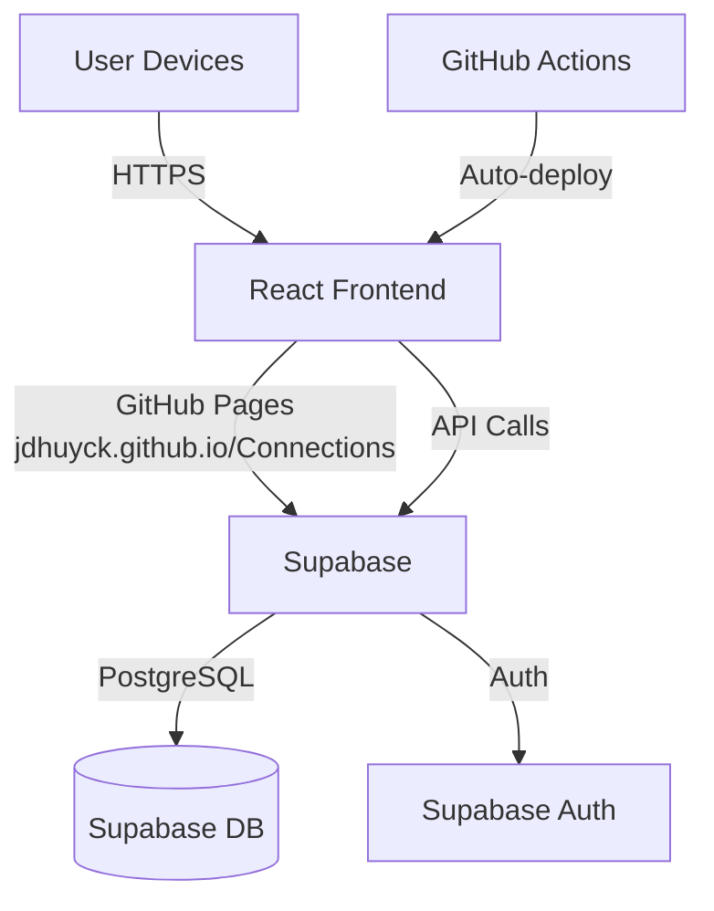
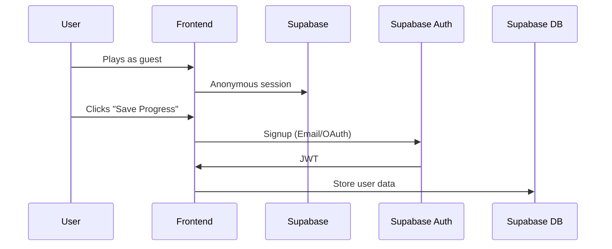

# Connections overview

## Architecture



## Front End - Github Pages /Connections subdirectory
React/ts static site
Communicates with backend via HTTPS
Stores guest session in local storage

/src
	/components
		PuzzleBoard.tsx
		CategorySelctor.tsx
	/pages
		PlayPage.tsx
		CreatePage.tsx
	/services
		api.ts

## Backend - Supabase

## Database structure
```mermaid
-- Public puzzles table
create table public.puzzles (
  id uuid primary key default uuid_generate_v4(),
  title text not null,
  creator_id uuid references auth.users,
  categories jsonb not null,
  created_at timestamp default now(),
  is_public boolean default false
);

-- Enable Row Level Security
alter table public.puzzles enable row level security;

-- Create policies
create policy "Public puzzles are visible"
  on public.puzzles for select
  using (is_public = true);
```