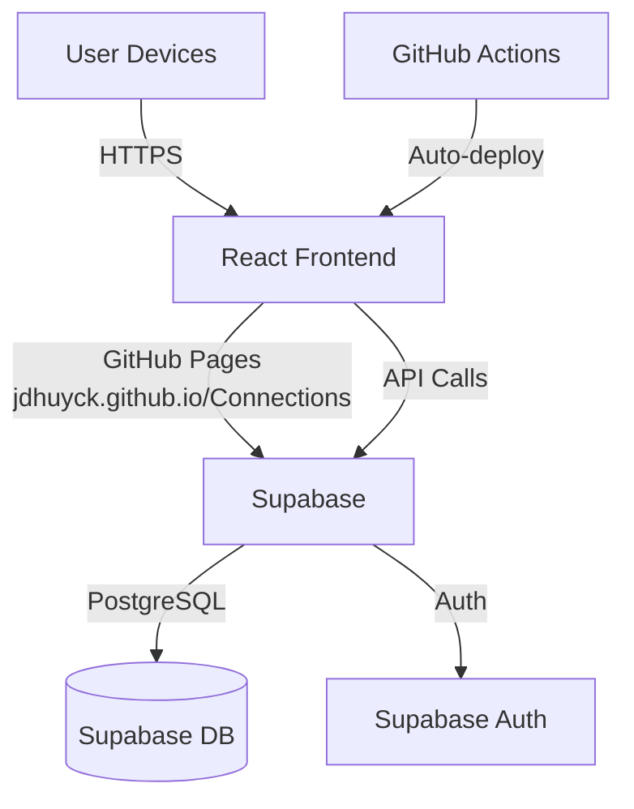
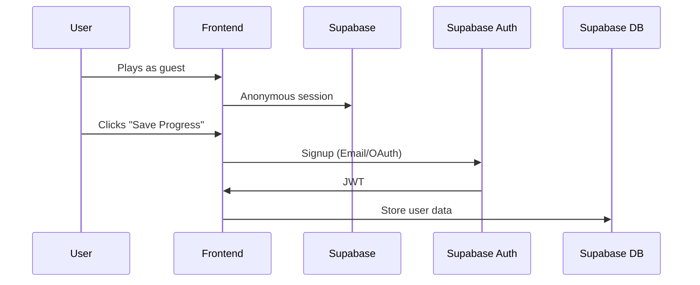

# Connections overview

## Architecture



## Front End - Github Pages /Connections subdirectory
React/ts static site
Communicates with backend via HTTPS
Stores guest session in local storage

/src
	/components
		PuzzleBoard.tsx
		CategorySelctor.tsx
	/pages
		PlayPage.tsx
		CreatePage.tsx
	/services
		api.ts

## Backend - Supabase

## Database structure
```bash
create extension if not exists pgcrypto;

create table puzzles (
  id uuid primary key default gen_random_uuid(),
  title text not null,
  categories jsonb not null,
  creator_id uuid references auth.users on delete set null,
  created_at timestamp with time zone default timezone("utc"::text, now()),
  is_public boolean default false,
  difficulty smallint
);

alter table puzzles enable row level security;

create policy "Public puzzles are visible to all"
  on puzzles for select
  using (is_public = true);

create policy "Users can manage their own puzzles"
  on puzzles for all
  using (auth.uid() = creator_id);
```